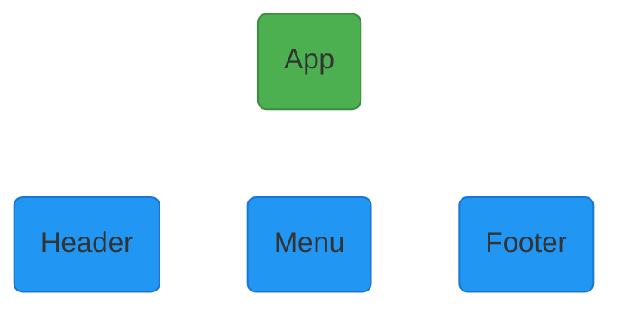

# Pizza Menu Project
* Author: CLIN
* Date: 2025-07-23

## Purpose: learn React

## Component Tree

```mermaid
flowchart TD

    A(App)
    B(Header)
    C(Menu)
    E(Footer)


    A ~~~ B
    A ~~~ C
    A ~~~ E

    classDef app fill:#4CAF50,stroke:#388E3C;
    classDef primary fill:#2196F3,stroke:#1976D2;
    classDef support fill:#FF8107,stroke:#FFA000;
        
    class A app;
    class B,C,E primary;
    class D,D2,D3,F support;
```